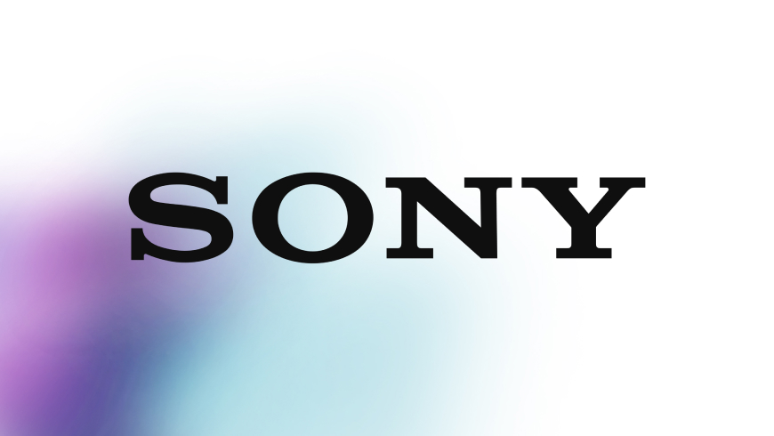

# 박에스더 SONY 리뉴얼 프로젝트
 
 🔗 http://esthersony.dothome.co.kr/sonyrenewal/ 
 

 
<strong>고객은 가능성을 보고 소니는 솔루션을 상상합니다. </strong>
 
#소니스토어 #소니제품 #혁신의아이콘 #소니리뉴얼

  

## 프로젝트 소개

<strong>"트랜디하지만 동시에 신뢰감 있는."</strong>

-> 소니는 '혁신의 아이콘'이라는 명성에 걸맞게 최첨단 기술이 적용된 제품들을 선보입니다.  
그 중 ‘소니 스토어’ 는 고품질 전자기기(카메라와 음향기기등)를 판매하는 사이트입니다. 
기존의 단순한 사이트 디자인에서 사이트의 주 고객층인 젊은 청년층을 페르소나로 선정하여,
트랜디하면서도 신뢰감을 주는 디자인으로 리뉴얼하게 되었습니다. 

## 웹 인터페이스

## 모바일 인터페이스

  

## 🗓 개발 기간 및 작업 관리

### 개발 기간
> 전체 기획 및 개발 기간 : 2024.03 ~ 2024.05  
> UI 디자인 : 2024.03 ~ 2024.03.07  
> 기능(html/css) 구현 : 2024.03.07 ~ 2024.05.07 

### 작업 관리
> figma로 간단한 기획서를 제작한뒤 리뉴얼 디자인을 했습니다. 
    다음으로 관리자 게시판과 내용 관리 설정 후, 그누보드 변수를 통한 최근 게시와 게시판을 튜닝함으로써 
    80% 이상 지속적인 컨텐츠 관리와 업데이트가 용이하도록 편리한 사이트를 제작했습니다. 

🔗 figma (https://www.figma.com/design/P82dv0RnNh91sBjZVtrjXl/SONY-%EB%A6%AC%EB%89%B4%EC%96%BC?node-id=0-1&t=O3NqZAUB7X2Z29DD-1)

  

## 💬 사용언어
- html / scss / bootstrap 그리드 시스템을 사용을 통한 빠른 반응형 제작
- javascript
- 그누보드

  

## ⚙ 개발도구(IDE)
- VScode
- figma
- Adobe XD
- Illustrator
- Photoshop